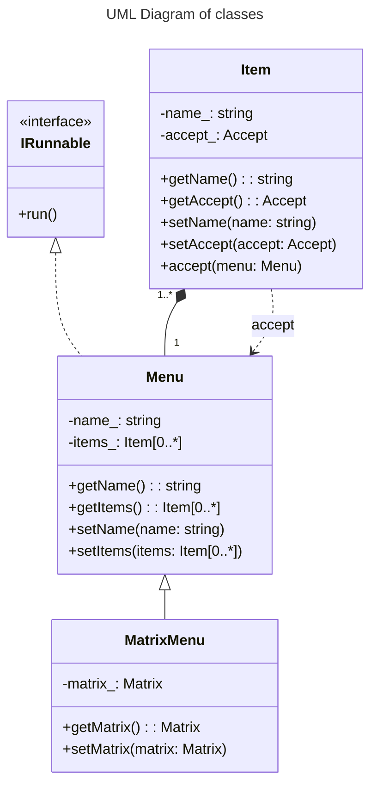

# MatrixManipulation
MSTU project of djdxr and sun-demon

```mermaid
---
title: UML Diagram of classes
---
classDiagram
    IRunnable <|.. Menu
    Item "1..*" *-- "1" Menu
    Item ..> Menu : accept
    Menu <|-- MatrixMenu

    class IRunnable {
        <<interface>>
        +run()
    }
    class Item {
        -name_: string
        -accept_: Accept
        +getName(): string
        +getAccept(): Accept
        +setName(name: string)
        +setAccept(accept: Accept)
        +accept(menu: Menu)
    }
    class Menu {
        -name_: string
        -items_: Item[0..*]
        +getName(): string
        +getItems(): Item[0..*]
        +setName(name: string)
        +setItems(items: Item[0..*])
    }
    class MatrixMenu {
        -matrix_: Matrix
        +getMatrix(): Matrix
        +setMatrix(matrix: Matrix)
    }
```
